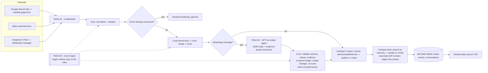

# FANA Lead Qualifier - Al Tilal Al Sharqiya Auction

A working prototype that takes auction leads from 3 channels, normalizes and deduplicates them,
qualifies them in Arabic with an LLM agent, scores them with transparent rules, syncs Contacts and
Deals to HubSpot, and produces a ranked sales queue that tells a salesperson **who to call first and why**.

**Stack:** n8n Cloud (orchestration) · Azure OpenAI GPT-4o (Arabic agent) · HubSpot Free (CRM) ·
Python (source-of-truth rules, tests, scenario runner) · JavaScript port of the rules inside n8n.

| Deliverable | Where |
|---|---|
| Channel plan | [`docs/channel_plan.md`](docs/channel_plan.md) |
| Common lead schema (PDF field -> schema field) | [`docs/lead_schema.md`](docs/lead_schema.md) |
| Scoring, priority, ranking explained (ownership, weights, worked live examples) | [`docs/scoring.md`](docs/scoring.md) |
| CSV import | `scripts/import_csv.py` + `fixtures/sample_import.csv` |
| Architecture diagram | [below](#architecture) |
| n8n workflows (exported) | `n8n/workflows/*.json` · runtime core: `n8n/fana_core.js` |
| 10-scenario test log | [`outputs/test_log.md`](outputs/test_log.md) (offline, 10/10) · [`outputs/live_gpt4o_test_log.md`](outputs/live_gpt4o_test_log.md) (live GPT-4o) · [`outputs/phase2_live_test_log.md`](outputs/phase2_live_test_log.md) (live CRM) |
| Prioritized sales list | Live: `outputs/sales_queue_live.csv` (FANA 03, real leads) · offline: [`outputs/sales_queue.csv`](outputs/sales_queue.csv) |
| HubSpot evidence | `docs/screenshots/` |

---

## Architecture



**n8n workflows** (folder *FANA AI Media Buying & Lead Optimization System*):

| Workflow | Role |
|---|---|
| FANA 00 - HubSpot Setup | Creates 17 custom properties and the deal pipeline stages. Safe to re-run: existing properties return 409 and existing stages are **skipped** (never replaced, so stage IDs stay stable) |
| FANA 01 - Lead Intake & CRM Sync | 3 webhooks -> normalize -> idempotency -> merge/score -> agent -> Contact + Deal upsert -> save -> respond |
| FANA 02 - Arabic Qualification Agent | Builds the prompt, calls GPT-4o, validates via Core, stores both conversation turns |
| FANA 03 - Sales Queue Export | Reads every live lead, ranks with the Core Engine, outputs **Excel (.xlsx, Arabic-safe) + CSV** with next action + reason |
| FANA 90 - Core Engine | Sub-workflow with all deterministic rules (`normalize`, `merge_score`, `apply_ai`, `score`, `rank`) |
| FANA 99 - Error Handler | Error workflow of FANA 01/02/03/90: logs every failed run to `fana_event_log` and sends a Telegram alert |

---

## Setup

**Offline (no credentials) - reproduces all 10 scenarios**
```bash
pip install -r requirements.txt
python -m pytest -q                 # 54 tests incl. Python <-> JavaScript parity
python scripts/run_scenarios.py     # writes outputs/test_log.md and outputs/sales_queue.csv
python scripts/import_csv.py fixtures/sample_import.csv            # CSV import through the same pipeline
python scripts/import_csv.py fixtures/sample_import.csv --live https://<n8n>/webhook/fana/landing
```

**Live (n8n Cloud + HubSpot + Azure OpenAI)**
1. Import `n8n/workflows/*.json` into one n8n folder. Create Data Tables (then update their IDs in the nodes):
   `fana_leads` (lead_key, lead_json, name, mobile, email, priority, score, qualification_status, hubspot_contact_id, hubspot_deal_id, last_interaction_at),
   `fana_processed_events` (event_key, source, lead_key, outcome, received_at), `fana_conversations` (lead_key, role, text, at, meta),
   `fana_event_log` (level, stage, lead_key, message, at).
2. Create credentials in n8n (never in the repo): HubSpot (OAuth2 or private-app token with contacts/deals
   objects + schemas read/write), Azure OpenAI (resource/endpoint, API version `2024-12-01-preview`, deployment `gpt-4o`).
3. Run **FANA 00** once. Publish **FANA 90** and **FANA 02** (nested sub-workflows must be published), then FANA 01.
4. POST the payloads in `fixtures/scenarios.json` (`steps[].payload`) to `/webhook/fana/landing`, `/fana/meta`, `/fana/whatsapp`.

`.env.example` lists the non-secret settings; `.env` is git-ignored.

---

## Technology choices (and why)

- **n8n Cloud** for orchestration: webhooks, retries, credentials store, visual flow the sales/ops team can follow.
- **Rules in code, language in the LLM.** GPT-4o only writes the Arabic reply and proposes an extraction.
  Every decision (validation, dedupe, budget math, score, priority, queue order) is deterministic and unit-tested.
- **Python as source of truth, JS at runtime.** n8n Cloud's Python sandbox blocks all imports (even `re`),
  so the rules run as a JavaScript port (`n8n/fana_core.js`). `tests/test_parity.py` feeds identical inputs to
  both and requires identical outputs (keys, scores, Arabic reasons, agent validation).
- **One Core Engine sub-workflow** holds the only runtime copy of the rules; other workflows call it.
- **3 channels only** (see channel plan): each maps to one intake format - form (Arabic keys), Meta `field_data`, WhatsApp Cloud API.
- **HTTP Request nodes for HubSpot** (not the HubSpot node) because dedupe needs phone search and deals need
  a custom key search + v4 associations.

---

## Common schema, normalization and dedupe

Full field-by-field mapping to the PDF (types, allowed values, unknown rules): **[`docs/lead_schema.md`](docs/lead_schema.md)**.
Every lead becomes one flat record (`src/fana/normalize.py`):

| Group | Fields |
|---|---|
| Identity & source | `lead_key`, `event_key`, `source`, `first_source`, `sources[]`, `campaign`, `name`, `mobile` (E.164), `email`, `city` |
| Buying needs | `interested_asset` (catalog id), `property_type`, `budget_min/max/raw/status/approx/flexible_up`, `investment_purpose`, `buyer_type`, `auction_experience` |
| Readiness & contact | `financing`, `timeline`, `preferred_contact`, `consent`, `intent` |
| Workflow record | `created_at`, `last_interaction_at`, `qualification_status`, `score`, `priority`, `reason_ar/en`, `confidence{}`, `history[]`, `issues[]`, HubSpot IDs |

- **Unknown stays unknown:** enums are `"unknown"`, values are `null`; nothing is guessed. Invalid inputs go to `issues[]` with the raw value.
- **Source field names:** alias map covers Arabic and English keys (`الجوال`, `phone_number`, `متى تنوي الشراء`...); unknown columns are kept in `unmapped_fields`.
- **CSV imports:** `scripts/import_csv.py` turns each row (Arabic or English headers, any order) into a landing-form payload with `campaign = csv_import:<file>` and a stable per-row `event_id`, so re-importing a file is ignored. Google Lead Forms are a planned fourth adapter using the same alias map.
- **Phones:** Arabic-Indic digits, `05…`, `5…`, `9665…`, `009665…`, spaces -> `+9665XXXXXXXX`; other GCC numbers kept as E.164; else `invalid`.
- **Dedupe key:** `lead_key = auction + mobile` (else email). Merge rule: newer known values win, unknown never overwrites known, every change goes to `history[]`.
- **Idempotency:** `event_key = hash(source + source event id)`; checked first, recorded **only after** HubSpot succeeds, so a failed run can be retried and a replay is ignored.
- **Existing CRM contacts:** searched by E.164 phone OR HubSpot's `hs_searchable_calculated_phone_number` (matches contacts typed by hand in any format, e.g. `0533334444`) OR email OR `fana_lead_key` before any create - live-tested with a contact created manually in HubSpot.

---

## Arabic qualification agent

- **State:** the lead record (known facts + confidence + history) and `fana_conversations` (every turn).
- **Ask only what is missing:** code computes `ask_next` (max 2 of asset -> budget -> financing -> timeline -> buyer type, including low-confidence ones). The prompt lists KNOWN FACTS the model must not ask again.
- **Output:** GPT-4o (Azure AI Foundry endpoint via HTTP Request, JSON mode) returns `reply_ar`, `extracted` (each field with `value`, `confidence`, and an **exact evidence quote**), `intent`, `flags`.
- **Validation (Core `apply_ai`):** unknown catalog ids, disallowed enum values and values whose evidence quote is not in the customer's message are rejected; budgets are re-parsed by the deterministic parser (`حول المليون` -> 850K-1.15M, `مليون ونص بالكثير` -> max 1.5M, `على حسب` -> uninterpretable -> review).
- **Changed answers:** latest explicit value wins; the old value is kept in `history[]` and the sales reason says "budget was revised".
- **Uses what is already known, across channels:** facts from forms/CSV are KNOWN FACTS in the prompt; live test: a lead who filled the Meta form + CSV was asked only "personal or company?" on WhatsApp.
- **Clarify first:** a vague answer (على حسب، يمكن، الله يسهل) must be clarified before any new question in the same turn (prompt rule), and any still-uncertain field is moved to the front of the next turn's questions (Build Prompt).
- **Sales handoff ready:** `sales_handoff_ready` = P1, OR asked for a person, OR all core facts collected (qualified). On the HubSpot Deal, in the AI summary and in both queue CSVs.
- **Escalation:** human request and opt-out are detected by the LLM **or** a keyword safety net limited to unambiguous words (موظف، مندوب، شخص حقيقي...). "كلموني / call me" is left to the LLM because it often means *contact me later* - a false handoff found and fixed during live testing. A request for a person stops questioning and sends a handoff reply; *contact later* caps the lead at P3 with the reason "طلب التواصل لاحقاً".
- **No invented facts:** the reply guard rejects any SAR amount the customer did not say and phrases like "يبدأ من"; the prompt forbids prices (prices are set by bidding). Rejected or failed LLM replies fall back to safe Arabic templates.

---

## Score, priority and ranking

Full explanation with decision-ownership table, weight rationale and worked live examples: **[`docs/scoring.md`](docs/scoring.md)**.

**Score (0-100)** - every point traceable to a field:

| Component | Points |
|---|---|
| Asset fit | specific asset 20 · type only 12 |
| Budget fit vs asset-type band | covers 25 · within 30% below 12 · below 0 |
| Financial readiness | cash / approved 20 · in progress 10 · needs financing 5 |
| Timeline | this auction 15 · within 3 months 8 · later 3 |
| Intent (LLM classification) | high 15 · medium 8 · low 2 |
| Contactability | valid mobile and consent not denied 5 |

Unknown = 0 points (and listed as missing), never a penalty beyond that.

**Priority gates (score alone is not enough):**
- **P1** = score >= 70 **and** funds ready (cash/approved) **and** timeline = this auction **and** asset known **and** no uncertain core field.
- **P2** = score >= 45, or P1-level score with financing unresolved ("held at P2").
- **P3** = everything else; price-only browsers and contact-later leads are capped at P3.
- **Human request** -> at least P2, status `handoff_requested`.
- **Low intent is P3 (nurture), not Disqualified** - a deliberate choice: a price-only browser still clicked a paid ad and may convert; Disqualified is reserved for confident, explicit signals.
- **Disqualified** only on confident facts: opt-out/consent denied, stated no interest, no valid contact, or confirmed budget < 50% of the cheapest asset band. Always with a reason.

**Uncertain is not unqualified:** a low-confidence core field sets `needs_review` and blocks P1, but never disqualifies.

**Who decides what:** LLM = Arabic reply, extraction proposals, intent class, flags. Rules = validation, budget numbers, score, priority, stage, ranking, reasons.

**Queue order:** priority -> asked for a person -> funds readiness (cash, approved, in progress, needed, unknown) -> score -> budget -> most recent interaction -> oldest lead.

**Reason:** built by code from the same facts, in Arabic and English, e.g.
`P2 (70/100) | فيلا سكنية - حي العقربية - الخبر | الميزانية 2M-3M ريال (مناسبة) | يحتاج تمويل | بقي P2: التمويل غير محسوم`

---

## HubSpot mapping

**Deal stages:** New Lead -> AI Qualifying -> Follow-up (P2) -> Sales Ready (P1) -> Contacted -> Registered to Bid -> Closed Won / Closed Lost.
Automation manages only the first four (and Closed Lost for disqualified); it **never moves a deal back** once sales has set Contacted, Registered or Won.

| Data | HubSpot field | Object |
|---|---|---|
| Name, mobile, email, city | `firstname`, `lastname`, `phone`, `email`, `city` | Contact |
| Source, contact preference, consent, dedupe key | `fana_lead_source`, `preferred_contact_method`, `contact_consent`, `fana_lead_key` | Contact |
| Interested asset | `interested_asset` (dropdown of the 11 assets + types) | Deal |
| Estimated budget | `budget_min`, `budget_max`, `amount` = midpoint | Deal |
| Score / status / priority | `qualification_score`, `qualification_status`, `sales_priority` | Deal |
| Timeline, financial readiness, channel | `purchase_timeline`, `financial_readiness`, `lead_channel` | Deal |
| Reason, AI summary | `priority_reason` (AR + EN), `ai_summary` (validated facts + last message) | Deal |

Qualification data lives on the **Deal** (per auction, per lead) so the same person can have other deals later; identity lives on the **Contact**.
One Deal per `fana_lead_key`; replays update it; it is associated to the Contact (v4 default association, idempotent).

---

## Reliability and data handling

| Area | Implemented | Planned |
|---|---|---|
| API failures | Retry x3 (2 s) + 10 s timeout on every HubSpot call; LLM timeout 30 s, 2 retries | Exponential backoff, rate-limit queue |
| LLM failure / malformed JSON | HTTP node retries x2, 30 s timeout, continues on error -> output treated as malformed -> safe template reply; lead still scored and saved (live-proven) | Strict JSON-schema mode; second model fallback |
| Duplicate webhooks | Event key checked first, recorded after CRM success (live-tested) | Webhook signature verification; a lock/queue for two identical events arriving at the same instant (both could pass the check before either is recorded; the CRM search still prevents most duplicates) |
| Duplicate records | Contact search phone/calculated phone/email/key; one Deal per lead key (live-tested). HubSpot search is eventually consistent, so the **stored `hubspot_deal_id` / `hubspot_contact_id` are used first** and search is the fallback (`deal_id_source` reported per run) | HubSpot unique-value property + batch upsert |
| Missing fields | Explicit `unknown`, listed in reason and `missing_fields` | - |
| Invented data | Evidence-quote check, catalog/enum allow-lists, reply guard, prompt rules | - |
| Human escalation | LLM flag OR keyword net; `handoff_requested` + top of queue; **Telegram alert to sales** when a lead becomes P1, asks for a person or needs review (only when the escalation type changes; alert failure never blocks processing) | Rotation/on-call routing; SLA timers |
| Logging | n8n executions; `fana_conversations` (accepted/rejected AI fields, guard violations, LLM errors); `fana_processed_events`; **FANA 99 writes every failed run to `fana_event_log`** (workflow, node, error, execution id - no customer payload) **and sends a Telegram alert** (tested) | Central log store + dashboards |
| Credentials | Only in n8n's credential store (HubSpot OAuth, Azure key, Telegram bot token); `.env` git-ignored; no keys in repo or workflow JSON | Secret rotation policy |
| Webhook security | - (prototype webhooks are unauthenticated) | Shared-secret header / Meta & WhatsApp signature verification |
| Personal data | Synthetic data only; no PII in URLs; only known values sent to CRM; error log stores no customer payload. **Known exposure:** Telegram alerts contain name + mobile (internal sales chat), and n8n execution history keeps full payloads | Mask mobile in alerts (or send only the HubSpot link); execution-data retention limit; deletion on request |

---

## Assumptions

- Asset list from the public auction page (11 assets, Dammam and Khobar). **The page shows no prices**, so budget
  bands per asset type in `src/fana/catalog.py` are **synthetic assumptions** used only for budget fit; the agent never quotes them.
- Channel budget SAR 150,000 over 4 weeks (see channel plan).
- WhatsApp is simulated with WhatsApp Cloud API payloads; replies are returned in the webhook response instead of being sent.
- A customer who starts a WhatsApp chat has consented to be contacted on WhatsApp.

## Known limitations (candid)

- The offline runner simulates HubSpot and replays recorded LLM outputs; live evidence covers scenarios 1, 2, 3, 5, 6, 7, 9, 10,
  replay and Deal association (`outputs/phase2_live_test_log.md`, `outputs/live_gpt4o_test_log.md`). **All 10 scenarios are proven live** plus the named §3 cases (around one million + financing, contact later).
- The Azure endpoint is called with an HTTP Request node (AI Foundry `cognitiveservices` domain is not supported by n8n's
  LangChain Azure node); the endpoint URL is configuration in the node.
- If the LLM is unavailable, WhatsApp free text gets no extraction (the lead is saved, scored and gets a safe template question; forms are unaffected). Planned: a deterministic fallback extraction (catalog match + budget parser) on the message text.
- Form leads (e.g. scenario 4) get no outbound first WhatsApp message; the agent only replies to inbound messages. The next question is computed (`ask_next`) but not sent.
- `ai_summary` in HubSpot is assembled by code from validated facts (not free LLM text) - a deliberate anti-hallucination choice.
- Name merge is "newer wins" (an English profile name can replace an Arabic form name); better: keep the fuller name.
- Budget bands are assumptions; real opening prices would replace them.
- No outbound WhatsApp sending, no sales alerting, no error workflow yet (see Planned).
- The JS runtime is a port; parity tests reduce but do not eliminate drift risk.
